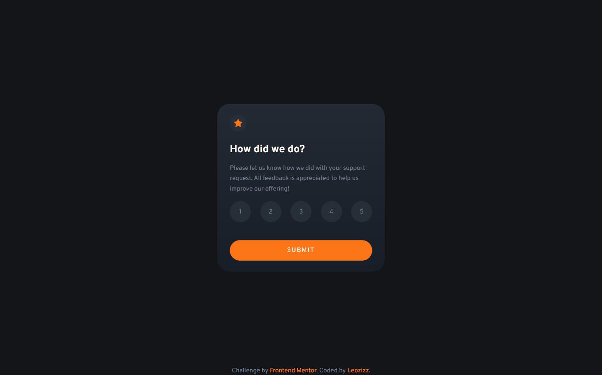
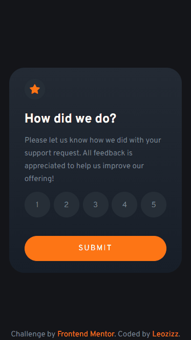

# Interactive Rating Component
This is my solution to the Interactive Rating Component challenge from Frontend Mentor.

Users can view the optimal layout for the app depending on their device's screen size, see hover states for all interactive elements on the page, select and submit a number rating, and see the "Thank you" card state after submitting a rating.

## Table of contents

- [Overview](#overview)
  - [The challenge](#the-challenge)
  - [Preview](#preview)
  - [Links](#links)
- [My process](#my-process)
  - [Built with](#built-with)
  - [What I Used](#what-i-used)
  - [Continued development](#continued-development)
- [Author](#author)
- [Acknowledgments](#acknowledgments)

## Overview
### The Challenge

The challenge was to build an interactive rating component that users can interact with to submit a rating and see a "Thank you" message. The component had to be built with a mobile-first approach and be fully responsive to different screen sizes. The design had to be implemented as closely as possible to the provided design file, with hover states for interactive elements.

## Preview

#### Mobile Preview

## Links

Solution URL: https://github.com/leozizz/interactive-rating-component

Live Site URL: https://leozizz.github.io/interactive-rating-component/

## My Process

### Built With

- HTML5
- CSS3
    - CSS Variables / Custom Properties
    - Flexbox
    - Media Queries
- JavaScript

## What I Used
While working on this project, I used:

- CSS flexbox and media queries to create a responsive layout.
- CSS variables for easy maintenance and organization.
- Implemented hover states for interactive elements using CSS.
- JavaScript to add interactivity to the component.

## Continued Development

In the future, I plan to:

- Refactor the JavaScript code to make it more efficient and modular.
- Use a CSS preprocessor such as Sass to improve the maintainability of the CSS code.

## Author
GitHub - https://github.com/leozizz

Frontend Mentor - [@leozizz](https://www.frontendmentor.io/profile/leozizz)

LinkedIn - [Leonardo Silva](https://www.linkedin.com/in/leozizz/)

## Acknowledgments
I would like to thank Frontend Mentor for providing this challenge, as it allowed me to practice and improve my skills in HTML, CSS, and JavaScript.